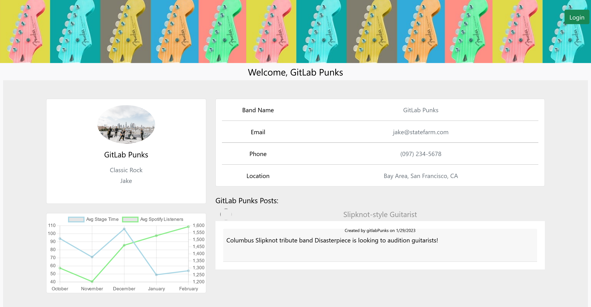
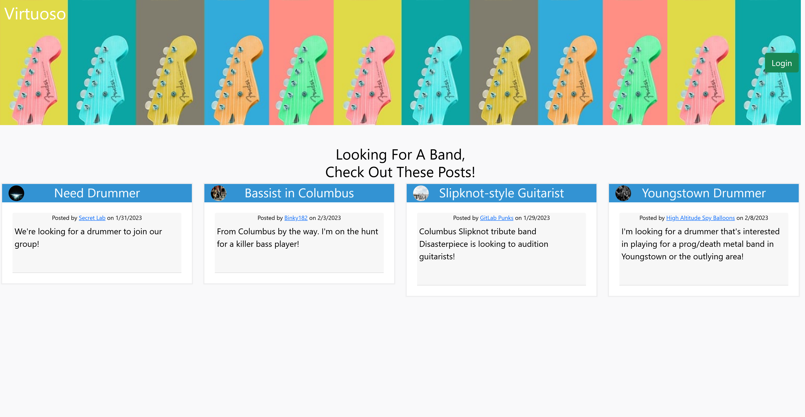

# Virtuoso

## Table of Contents
- [Description](#description)
- [Deployed-Application](#deployed-application)
- [GitHub](#Github)
- [Presentation](#presentation)
- [Contribution](#contribution)
- [Questions](#questions)
- [License](#license)
  
## Description
Virtuoso is a business and performance-focused social media platform that works through artist job-listings and crowds size played using Chart.js.
  
## Deployed Application

https://team-6-virtuoso.herokuapp.com/

  
## Github

https://github.com/RetroTechCode/virtuoso

## Presentation

[View our presentation on Google Slides](https://docs.google.com/presentation/d/15hPEqO6ROrkO92178fiJCBRkv4tShTQ_hAaywiMQwMQ/edit#slide=id.g18977fa8e0f_0_322)

## Contribution
[RetroTechCode](https://github.com/RetroTechCode)  
[lutz143](https://github.com/lutz143)  
[WarfaHa](https://github.com/WarfaHa)  
[Projectmayhem90](https://github.com/Projectmayhem90)  

  
## Questions

**If you have any additional questions please reach out to me here**:
- Github: [RetroTechCode](https://github.com/RetroTechCode/virtuoso)

## License
This application uses the MIT license. [Find more information here.](https://choosealicense.com/licenses/mit/)

